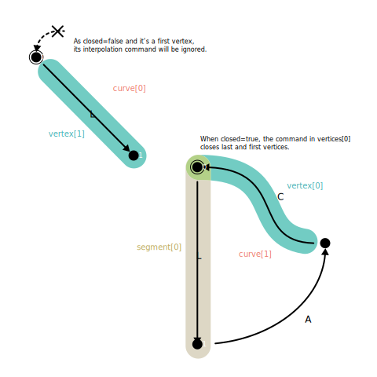

# ガイド

## インストール

```sh
npm i @baku89/pave
```

## 使い方

### インポート

ESモジュールをサポートしているため、import文を使って読み込むことが出来ます。`Path`や`CubicBeizer`などのシンボルは、型としても、あるいはその型に関連した関数から成るモジュール（名前空間）としても利用できます。

```ts
import {Path} from '@baku89/pave'

const rect: Path = Path.rect([0, 0], [10, 10])

Path.toSVGString(rect) // => 'M0,0 L10,0 L10,10 L0,10 Z'
```

### イミュータブルなデータ

気をつけてほしいのは、Paveは関数型プログラミング志向であり、全てのデータはプレーンかつイミュータブルであるということです。パスの長さやバウンディングボックスといったパスに付随する情報は、パスデータ自体のプロパティとしてアクセスする代わりに関数を用いて取得します。

```ts
const length = Path.length(rect)
const bounds = Path.bounds(rect)
const normal = Path.normalAtTime(rect, 0.5)
```

これらの関数は適切にキャッシュ（メモ化）するため、同じパスに対して何度も呼び出しても全ての計算が再実行されることはありません。しかし、パスデータに対して破壊的な変更を加えた後にこれらの関数を呼び出すと、正しい結果が得られないことがあります。

このため、パスデータを変更する際には、常に新しいパスデータを生成するユーティリティ関数（Canvas APIと同様の`moveTo`や`lineTo`など）を使うか:

```ts
let p = Path.moveTo(Path.empty, [10, 10])
p = Path.lineTo(p, [20, 20])
p = Path.cubicBezierTo(p, [80, 30], [0, 40], [50, 50])
p = Path.closePath(p)
```

あるいは、[immer](https://immerjs.github.io/immer/)のようなイミュータブルなデータ構造を操作するためのライブラリを使うことをお勧めします:

```ts
import {produce} from 'immer'

const pathA = Path.arc([50, 50], 40, 0, 90)
const pathB = produce(pathA, draft => {
	draft.curves[0].closed = true
})
```

### ベクトル、トランスフォーム

ベクトルや行列は、プレーンな1次元の数値配列として表現されています。例えば、位置は`[x, y]`、2次元のアフィン変換は`[a, b, c, d, tx, ty]`といったようにです。これらのデータの操作は、[Linearly](https://baku89.github.io/linearly)や[gl-matrix](https://glmatrix.net/) などのライブラリを用いて操作することが出来ますが、後者はミュータブルな値の変更を許容するため、Paveと同様にイミュータブルなデータを前提として設計されたLinearlyとの併用をおすすめします。

```ts
import {vec2, mat2d} from 'linearly'

const c = Path.ellipse(vec2.zero, vec2.of(20, 30))
const t = Path.transform(c, mat2d.fromTranslation([50, 50]))
```

### 角度

Paveでは、**角度は度数法で表現されます**。JavaScriptの標準の`Math`や`Canvas2DRenderingContext`などではラジアン法が用いられているため、ラジアン法との変換が必要な場合、Linearlyの`rad`関数などを用いて変換してください。なお、Linearlyにおける角度も度数法で表現されるため、`scalar.cos(90) === 0`のように度数法での計算が可能です。

### 各種データとの相互変換

SVGのd属性やCanvas APIのPath2Dといった他のパスデータとの相互変換もサポートされています。

```ts
// 他のパス表現からPathへ
Path.fromSVGString('M10,50 C34,100 75,0 90,50')
Path.fromSVG(['M', [10, 50], 'L', [90, 50], 'Z'])

// Pathから他のパス表現へ
Path.toSVGString(line) // => 'M0,0 L100,100'
Path.toSVG(line) // => ['M', [0, 0], 'L', [100, 100]]
Path.toPath2D(line) // => an instance of Path2D

// 直接Canvas APIに描画
Path.drawToCanvas(line, canvasContext)
canvasContext.stroke()
```

## パスのデータ構造

### パスの階層構造

Paveにおけるパスの表現は、SVGのd属性やCanvas APIのような、状態を持つキャンバスに対する描画コマンドの連続ではなく、常に頂点をベースとしています。つまり、`moveTo`（SVGにおける`M`コマンド）や `closePath` （SVGにおける `Z`）のような操作は存在せず、パスは常に**頂点の位置と最後の頂点からの補間コマンドの組**のリストで構成されます。

また、パスのデータ構造は以下のような階層を成しています。ちょうど3DCGデータにおいて、頂点の集まりからポリゴンが、ポリゴンの集まりからメッシュが形作られるのとも似ています。



- [**Path**](./api/interfaces/Path): 単一のCurve、もしくは複数のCurveから成る複合パスを表します。Paveにおける最も一般的な型です。
- [**Curve**](./api/interfaces/Curve): 単一の開いた、または閉じたストロークを表現します。
- [**Vertex**](./api/#vertex): ストロークを構成する各頂点です。SVG等ではコマンドの末尾に終了点が含まれていますが、Vertexは終了点を`point`プロパティ、それ以外のパラメーターを`command`プロパティとして区別します。
- [**Command**](./api#command): 終了点を除く補間コマンドの引数。

::: tip
各Curveの最初の頂点の補間コマンドは、閉じている合は最後の頂点から最初の頂点への補間コマンドとして、開いたカーブの場合単に無視されます。
:::

TypeScriptに慣れている方は、型定義を見てもらう方が分かりやすいでしょう。

```ts
type Path = {paths: Curves[]; fillRule: 'nonzero' | 'evenodd'}
type Curve = {vertices: Vertex[]; closed: boolean}
type Vertex = {point: vec2; command: Command}
type Command =
	| ['L']
	| ['C', control1: vec2, control2: vec2]
	| ['A', radii: vec2, xRot: vec2, largeArc: boolean, sweep: boolean]
```

::: tip
Paveは`L`（直線）、`C`（3次ベジェ曲線）、`A`（楕円弧）の3つの補間コマンドのみを内部表現として用います。SVGの`Q`（2次ベジェ曲線）などその他のコマンドは、これらの3つのいずれかに正確に変換されます。
:::

::: tip
`C`コマンドの制御点は、開始点・終了点からの相対的な位置ではなく、絶対位置で表されます。
:::

### セグメント

また、上記の階層とは別に、Curveのうち単一のコマンドに対応する部分を切り取った[Segment](./api/interfaces/Segment)という型も存在します。Vertexと異なり、開始点と終了点の両方の情報も含みます。

```ts
type Segment = {start: vec2; end: vec2; command: Command}
```

### パス上の位置表現

セグメント上の特定の位置を表すために、次の3つの表現を用いることができます。

- **Unit**: セグメント上の開始点と終了点に対する相対的な位置。Paveにおけるデフォルト表現です。`[0, 1]`の範囲をとります。
- **Offset**: 開始点からの距離による表現。`0`は開始点、セグメントの長さが終了点に対応します。
- **Time**: セグメントに用いられる数理曲線の媒介変数による表現。`[0, 1]`の範囲をとります。残りの2つの位置表現と異なり、timeは3次ベジェ補間や楕円弧において、セグメント上で等間隔に分布しない場合があることに注意してください。

```ts
type UnitLocation = number | {unit: number}
type OffsetLocation = {offset: number; cyclic?: boolean}
type TimeLocation = {time: number}

type SegmentLocation = UnitLocation | OffsetLocation | TimeLocation
```

CurveやPathなど、複数のセグメントからなる曲線上の位置を表すには、上記の表現に加えて、頂点やカーブのインデックスを指定することが出来ます。もし指定されない場合、unitにおいては全体の曲線長に対する`[0, 1]`の範囲をとる相対的な位置として、timeにおいては、`[0, 1]`をセグメントの個数で等分した媒介変数の値として扱われます。（2つのセグメントからなるパスを例に挙げると、`{time: 0.25}`は1番目のセグメントにおける`{time: 0.5}`に対応します）

```ts
type UnitPathLocation =
	| number
	| {
			unit: number
			vertexIndex?: number
			curveIndex?: number
	  }

type OffsetPathLocation = {
	offset: number
	vertexIndex?: number
	curveIndex?: number
	cyclic?: boolean
}

type TimePathLocation = {
	time: number
	vertexIndex?: number
	curveIndex?: number
}

type PathLocation = UnitPathLocation | OffsetPathLocation | TimePathLocation
```

:::tip
範囲外の値を指定した場合、自動的にクランプされます。ただし、offsetにおいて`cyclic`プロパティが`true`の場合、始点からループします。
:::

また、位置表現があるセグメントの終点とも後続のセグメントの始点とも解釈されるような場合は、セグメントの始点の方が優先されます。例えば、2つの分離した直線から成るパスにおいて、`{time: 0.5}`は1番目の直線の終点と2番目の直線の始点の両方を指す可能性がありますが、このルールにより2番目の直線の始点が優先されます。もし1番目の直線の終点を指したい場合は、`{time: 1, curveIndex: 0}`のように明示する必要があります。
